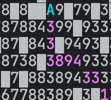

This file is written in english, as I do not have Ukrainian keys on my keyboard, and writing in English is more convenient to me:)

The logic behind calculations are as follows:

    All points have a distance of 1 km.
    If I am on a point A and I can go to a point B through diagonal,
    then I will travel with the speed of point B not for 1 km but for sqrt(2) km.

That is why on a photo above it does not cut a corner, as if it did the time would be:

sqrt(2) * 3600 / (60 - 7 * 6) = 200 * sqrt(2) (approximately 283)

instead it went with a time:

3600 / (60 - 2 * 6) + 3600 / (60 - 7 * 6) = 275

I thought that this logic is the most appropriate, but I believe that another variant is possible
(When travelling from A to B through diagonal, I will travel for with the speed of A for sqrt(2) km (instead of B))

When adding a new point to a queue octile distance is multiplied by 60, this should not make it greater than the cost of moving from n to the goal,
but really close to it.

I chose to use octile distance based on these articles:

https://theory.stanford.edu/%7Eamitp/GameProgramming/Heuristics.html

https://theory.stanford.edu/%7Eamitp/GameProgramming/Variations.html#any-angle-movement 